[](https://opensource.org/licenses/Apache-2.0)

# S⋈N

Universal ERP migration platform. Any ERP to SAP S/4HANA.

Replaces 6-month migration timelines with automated, code-driven execution. Everything runs in a GitHub Codespace -- no SAP credentials required for development and testing.

## Platform Overview

```mermaid
graph TB
    subgraph "Migration Engine (874 rules, 42 objects, 52 processes, 43 MCP tools)"
        ASSESS[Phase 1: Assess<br/>874 custom code rules<br/>21 SAP modules]
        REMED[Phase 2: Remediate<br/>Auto-fix suggestions<br/>per rule]
        PROFILE[Phase 3: Profile<br/>Data quality analysis<br/>Fuzzy duplicate detection]
        SDT[Phase 4: SDT<br/>52 E2E test scenarios<br/>Auto-generated]
        CONFIG[Phase 5: Configure<br/>FI/CO/MM/SD configs<br/>Template-driven]
        PROV[Phase 6: Provision<br/>42 migration objects<br/>1600+ field mappings]
        TEST[Phase 7: Test<br/>6-check reconciliation<br/>per object]
        CUT[Phase 8: Cutover<br/>Critical path scheduling<br/>Rollback plan]
    end

    subgraph "Enterprise Infrastructure"
        SEC[Security Layer<br/>Input validation, Rate limiting<br/>Audit logging, CORS, Headers<br/>XSUAA Authentication]
        MON[Monitoring<br/>Health checks, Metrics<br/>Prometheus export<br/>Real-time SSE dashboard]
        CICD[CI/CD<br/>GitHub Actions, Docker<br/>Multi-node matrix]
        PERSIST[Persistence<br/>SQLite dev, HANA Cloud prod<br/>Checkpoint/Resume]
    end

    subgraph "Development Toolkit"
        CAP[CAP Backend<br/>OData V4 + Draft]
        FE[Fiori Elements UI]
        DIS[API Discovery Scanner]
        AG[AI Agent<br/>Live execution<br/>Multi-provider LLM]
    end

    subgraph "Ecosystem (Pillars 6-8)"
        SIG[Signavio<br/>BPMN parser<br/>Process-to-config]
        TESTENG[Testing Engine<br/>AI test generation<br/>31 templates<br/>Live test harness]
        CLOUD[Cloud Modules<br/>SF, Ariba, Concur, SAC]
        MCP[MCP Server<br/>43 SAP tools<br/>JSON-RPC 2.0]
    end

    subgraph "Connectivity"
        ODATA[OData Client<br/>V2/V4, CSRF, Batch<br/>Retry + Pagination]
        RFC[RFC Client<br/>Connection pool<br/>Table reader]
        CONNMGR[Connection Manager<br/>Multi-source profiles<br/>Health checks]
        TRANSPORT[Transport Manager<br/>Create, release, track<br/>Rollback support]
    end

    ASSESS --> REMED --> PROFILE --> SDT --> CONFIG --> PROV --> TEST --> CUT
```



## Quick Start

### In Codespace (recommended)
1. Click **Code > Codespaces > New codespace** on this repository
2. Wait for setup to complete (installs SAP tools automatically)
3. Run `npm run watch` -- server starts on port 4004
4. Run `npm test` -- 4,910 tests across 251 files

### Local Development
```bash
git clone <this-repo>
cd sapconnect
npm install
npm install -g @sap/cds-dk
npm run watch
```

### Docker
```bash
docker build -t sapconnect .
docker run -p 4004:4004 sapconnect
# Or with docker compose:
docker compose up
```

### Run Migration Assessment
```bash
npm run assess                    # Scan custom code against 874 rules
npm test                          # Run full test suite (4,910 tests)
npm run lint                      # ESLint code quality check
node -e "
  const R = require('./migration/objects/registry');
  const r = new R();
  r.runAll({ mode: 'mock' }).then(res => console.log(JSON.stringify(res.stats, null, 2)))
"                                 # Run all 42 migration objects
```

## What's Inside

| Component | Scale | Description |
|-----------|-------|-------------|
| **Rule Engine** | 874 rules, 21 modules | Custom code analysis: FI(80), ABAP(80), MM(67), SD(65), HR(53), CO(52), PP(47), plus 14 more |
| **Migration Objects** | 42 objects, 1600+ fields | Full ETLV lifecycle: GL, AR/AP, BP, Material, PO, SO, Assets, PM, PP, EWM, TM, GTS, BW |
| **Business Processes** | 52 E2E flows, 14 modules | Order-to-Cash, Procure-to-Pay, Payroll, Maintenance, Freight, Compliance, Year-End Close |
| **Data Quality** | 6 check types | Required fields, exact/fuzzy duplicates, referential integrity, format, range validation |
| **Reconciliation** | 6 checks per object | Count, key coverage, aggregate, field sample, null analysis, duplicate detection |
| **Test Engine** | 4 scenario types | Comparison, regression, process, performance -- auto-generated from migration metadata |
| **Live Test Harness** | Dry-run + live mode | Safe validation of SAP operations with assertion helpers and automatic cleanup |
| **Dashboard API** | 8 REST endpoints + SSE | Summary, object detail, rules analysis, reconciliation, real-time progress streaming |
| **Cloud ALM** | 5 project templates | Greenfield, brownfield (core/full), selective data, landscape consolidation |
| **Cutover Planner** | Critical path + rollback | Dependency-aware task scheduling, 15-item go/no-go checklist, 8-step rollback plan |
| **Security** | 6 modules | Input validation, rate limiting, audit logging, security headers, CORS, XSUAA authentication |
| **Monitoring** | 4 modules + SSE | Health/readiness probes, Prometheus metrics, request correlation IDs, real-time event streaming |
| **Live Connectivity** | 42 service mappings | OData V2/V4 with CSRF, batch, retry, pagination; RFC pool + table reader |
| **Connection Manager** | Multi-source profiles | Named connection profiles with health checks and system landscape coordination |
| **Transport Manager** | Full lifecycle | Create, populate, release, and track transport requests with rollback support |
| **Dependency Graph** | 42 objects | Topological sort, execution waves, selective migration by module or object |
| **Migration Bridge** | Extraction to Migration | Forensic discovery feeds migration planning, scoping, risk assessment |
| **Archiving Advisor** | 10 archiving objects | Volume analysis and data reduction recommendations before migration |
| **Checkpoint/Resume** | File + HANA Cloud | Save/restore migration state, crash recovery, cleanup |
| **Persistence** | Dual-mode adapter | In-memory for development, HANA Cloud CDS for production deployments |
| **CI/CD** | GitHub Actions | Lint + test + security + Docker build, multi-node matrix (20/22) |
| **CAP Backend** | OData V4 | Customer service with draft support, business partner API |
| **Fiori Elements** | List Report + Object Page | Auto-generated UI from annotations |
| **API Discovery** | Scanner CLI | Discovers released APIs, events, and extension points |
| **AI Agent** | Live execution | Multi-agent orchestrator with tool-use loops, multi-provider LLM abstraction, safety gates |
| **Signavio** | BPMN 2.0 parser | Process model import, SAP config mapping, complexity analysis |
| **Testing Engine** | 31 templates, 6 modules | AI test generation from NL/config/BPMN, multi-format reporting |
| **SuccessFactors** | OData V2, 13 entity sets | CRUD, batch, effective dating, CSRF, metadata |
| **Ariba** | Procurement APIs | POs, requisitions, contracts, suppliers, reporting |
| **Concur** | REST V4 + SCIM 2.0 | Expenses, travel, user provisioning, list management |
| **SAC** | Analytics Cloud | Models, stories, data import, dimensions, planning |
| **MCP Server** | 43 tools, 4 resources | SAP tools for AI assistants via JSON-RPC 2.0 |

## 8-Phase Migration Methodology

| Phase | What | How | Output |
|-------|------|-----|--------|
| **1. Assess** | Scan custom code + interfaces | 874 rules across 21 modules, interface scanner | Risk score, findings by severity |
| **2. Remediate** | Fix flagged items | Per-rule remediation guidance, priority ranking | Clean code baseline |
| **3. Profile** | Analyze data quality | Levenshtein fuzzy matching, referential integrity | Quality report per object |
| **4. SDT** | Generate test scenarios | Auto-derive from objects + process catalog | 52+ executable test cases |
| **5. Configure** | Build target config | FI/CO/MM/SD config objects with templates | Migration-ready config records |
| **6. Provision** | Extract, Transform, Validate, Load | 42 objects with declarative field mappings | Migrated data in SAP format |
| **7. Test** | Reconcile source vs target | 6-check reconciliation engine | Pass/fail per object |
| **8. Cutover** | Execute go-live | Critical path scheduling, dependency graph | Cutover plan + rollback |

## Migration Objects (42)

**Finance**: GL Balance, GL Account Master, Customer Open Items, Vendor Open Items, Cost Element, Asset Acquisition, Profitability Segment

**Controlling**: Cost Center, Profit Center, Internal Order, WBS Element, FI/CO/MM/SD Config

**Logistics**: Material Master, Purchase Order, Sales Order, Pricing Conditions, Source List, Scheduling Agreement, Purchase Contract, Batch Master

**Plant Maintenance**: Equipment Master, Functional Location, Work Center, Maintenance Order

**Production**: Production Order, BOM & Routing, Inspection Plan

**Extended**: Warehouse Structure (EWM), Transport Route (TM), Trade Compliance (GTS), BW Extractor (BW)

**Interfaces**: RFC Destination, IDoc Config, Web Service, Batch Job

**HR**: Employee Master, Bank Master

## Enterprise Infrastructure

### Security
- **Input Validation** -- Schema-based validation for all API inputs with sanitization
- **Rate Limiting** -- Sliding window rate limiter with per-IP tracking and Retry-After headers
- **Audit Logging** -- Immutable audit trail with query/filter/stats, file or memory storage
- **Security Headers** -- OWASP headers (CSP, HSTS, X-Frame-Options, etc.)
- **CORS** -- Configurable origin whitelist with preflight support
- **XSUAA Authentication** -- JWT-based authentication with scope-based access control for SAP BTP deployments

### Monitoring & Observability
- **Health Checks** -- `/health` (liveness) and `/ready` (readiness) probes
- **Metrics** -- Counters, gauges, histograms with Prometheus text export at `/metrics`
- **Request Context** -- Correlation IDs via X-Request-ID/X-Correlation-ID propagation
- **Structured Logging** -- JSON or text format, log levels, child loggers
- **Real-Time Dashboard** -- Server-sent events streaming live progress for extraction, migration, and testing

### Persistence
- **Dual-Mode Adapter** -- In-memory store for development, HANA Cloud CDS for production
- **Checkpoint/Resume** -- Save and restore migration state at any point with crash recovery
- **CDS Entities** -- ExtractionRuns, ExtractionResults, Checkpoints, MigrationRuns

### CI/CD Pipeline
- **GitHub Actions** -- Lint, test (Node 20/22 matrix), security audit, Docker build
- **Docker** -- Multi-stage build, non-root user, health checks, < 200MB image
- **Code Quality** -- ESLint + Prettier with pre-commit enforcement
- **SAP BTP Deployment** -- MTA descriptor for Cloud Foundry with XSUAA and HANA Cloud bindings

### Live SAP Connectivity
- **OData Client** -- V2/V4, CSRF token management, batch operations, auto-pagination, retry with backoff
- **RFC Client** -- Connection pool with acquire/release, timeout, drain
- **Table Reader** -- RFC_READ_TABLE with FM fallback, streaming, WHERE clause splitting
- **Connection Manager** -- Multi-source named profiles with health checks and system landscape coordination
- **Transport Manager** -- Full lifecycle: create, populate, release, and track transport requests
- **Live Connector** -- Extract/load for 18 mapped objects with batch processing

## Key Commands

```bash
npm run watch        # Start CAP server with live reload
npm run discover     # Run API Discovery in mock mode
npm run agent        # Run AI Agent workflow in mock mode
npm run assess       # Run migration assessment
npm test             # Run 4,910 tests across 251 files
npm run lint         # Run ESLint
npm run format       # Run Prettier
npm run docker:build # Build Docker image
```

## Project Templates

| Template | Modules | Use Case |
|----------|---------|----------|
| `greenfield_full` | FI, CO, MM, SD, PP, QM, PM, PS, HR | New SAP implementation |
| `brownfield_core` | FI, CO | Finance-only conversion |
| `brownfield_full` | FI, CO, MM, SD, PP, QM, PM, PS | Full system conversion |
| `selective_data` | FI, CO, MM, SD | Data migration only |
| `landscape_consolidation` | FI, CO, MM, SD, PP, HR | Multi-system merge |

## Tech Stack

- **SAP CAP (Node.js)** -- Backend framework
- **SAP Fiori Elements / UI5** -- Frontend
- **SQLite in-memory / HANA Cloud** -- Local and production database
- **vitest** -- Test framework (4,910 tests, 251 files)
- **ESLint + Prettier** -- Code quality
- **Docker** -- Containerization
- **GitHub Actions** -- CI/CD
- **SAP BTP** -- Target deployment platform

## API Documentation

- [OpenAPI Spec](docs/openapi.yaml) -- Full REST API specification
- [Architecture Overview](docs/architecture-overview.md)
- [Getting Started](docs/getting-started.md)
- [Clean Core Guide](docs/clean-core-guide.md)
- [Integration Patterns](docs/integration-patterns.md)
- [What's Allowed (Public/Private/BTP)](docs/whats-allowed.md)
- [Demo Script](docs/demo-script.md)
- [API Discovery](discovery/README.md)
- [AI Agent](agent/README.md)

## Legal & Compliance

### License

SEN is licensed under the [Apache License 2.0](LICENSE). See the [NOTICE](NOTICE) file for trademark acknowledgments and compliance requirements.

### SAP Licensing

**SEN requires all users to hold valid SAP Named User licenses for any SAP system accessed through this tool.** SEN is a client application that calls SAP's published APIs on behalf of authenticated users — it does not grant, substitute, or extend SAP software licenses.

SEN interacts with SAP systems exclusively through publicly documented APIs (OData V2/V4, RFC, ADT REST) — the same interfaces used by SAP GUI, Eclipse ADT, and standard integration middleware. SEN does not modify, copy, or redistribute SAP software.

For detailed compliance guidance, see [SAP Licensing Compliance Guide](docs/sap-licensing-compliance.md).

### Trademarks

SAP, SAP S/4HANA, and other SAP product names are trademarks of SAP SE. SEN is an independent open-source project and is not affiliated with, endorsed by, or certified by SAP SE unless explicitly stated. All trademarks are used under nominative fair use.

### Security

To report security vulnerabilities, see [SECURITY.md](SECURITY.md).
