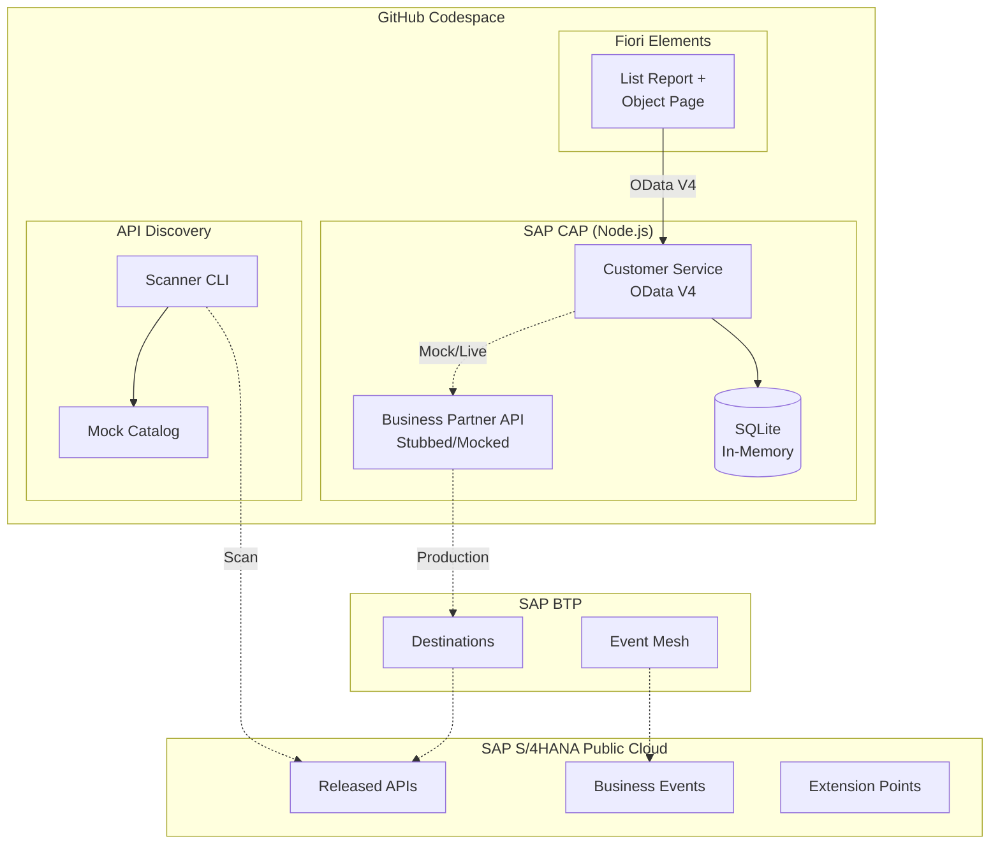

# SAP Connect

Demo & Pitch Toolkit for SAP Public Cloud External Development.

A GitHub Codespace that provides everything needed to demonstrate SAP integration patterns, discover client APIs, and prototype solutions following **Clean Core** principles.

## Architecture



## Quick Start

### In Codespace (recommended)
1. Click **Code > Codespaces > New codespace** on this repository
2. Wait for setup to complete (installs SAP tools automatically)
3. Run `npm run watch` - server starts on port 4004
4. Open the forwarded port to see the launcher page

### Local Development
```bash
git clone <this-repo>
cd sapconnect
npm install
npm install -g @sap/cds-dk
npm run watch
```

## What's Inside

| Component | Description |
|-----------|-------------|
| **CAP Backend** | OData V4 service with Customers, Projects, draft support |
| **Fiori Elements** | Auto-generated UI from annotations (List Report + Object Page) |
| **API Discovery** | CLI tool to scan SAP systems for available APIs and events |
| **AI Agent** | Multi-agent ABAP development assistant powered by Claude AI |
| **Mock Mode** | Everything works without a real SAP system |
| **Client Configs** | Swap between clients by changing environment files |

## Key Commands

```bash
npm run watch        # Start CAP server with live reload
npm run discover     # Run API Discovery in mock mode
npm run agent        # Run AI Agent workflow in mock mode
npm run demo         # Start in demo profile
```

## Endpoints (port 4004)

| Endpoint | Description |
|----------|-------------|
| `/` | Launcher page |
| `/api/customers/Customers` | Customer data (OData) |
| `/api/customers/Projects` | Project data (OData) |
| `/api/customers/getProjectStats()` | Project statistics |

## Multi-Client Support

SAP Connect supports multiple clients without separate codespaces:

```bash
# Set up a new client
cp -r clients/_template clients/my-client
cp clients/my-client/.env.template .env
# Edit .env with client details

# Switch clients
cp clients/other-client/.env.template .env
npm run watch
```

See [clients/_template/README.md](clients/_template/README.md) for details.

## Documentation

- [Architecture Overview](docs/architecture-overview.md)
- [Getting Started](docs/getting-started.md)
- [Clean Core Guide](docs/clean-core-guide.md)
- [Integration Patterns](docs/integration-patterns.md)
- [What's Allowed (Public/Private/BTP)](docs/whats-allowed.md)
- [Demo Script](docs/demo-script.md)
- [API Discovery](discovery/README.md)
- [AI Agent](agent/README.md)

## Tech Stack

- **SAP CAP (Node.js)** - Backend framework
- **SAP Fiori Elements / UI5** - Frontend
- **SQLite in-memory** - Local database
- **SAP BTP** - Target deployment platform
