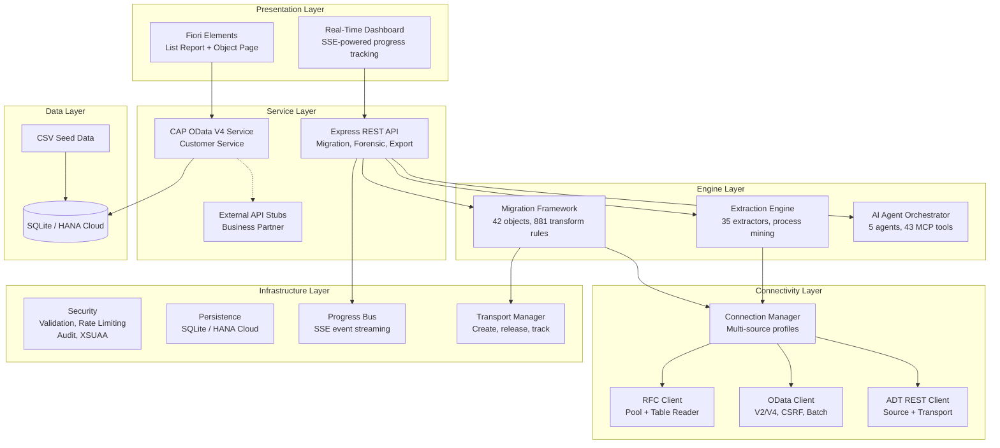
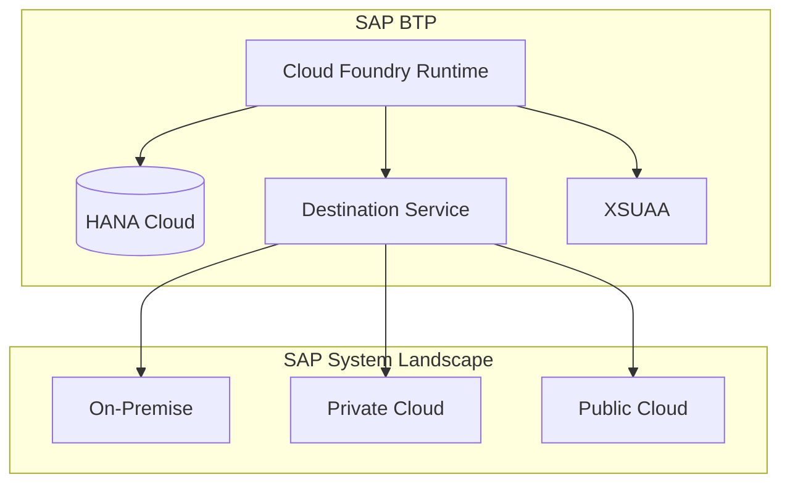

# Architecture Overview

## System Architecture

SEN follows a layered architecture with dual server design and three connectivity protocols:

## Component Details

### CAP Backend (`srv/`)

The backend uses SAP Cloud Application Programming Model (CAP) with Node.js:

- **OData V4 service** with automatic CRUD operations
- **Draft support** for Customers entity (edit sessions)
- **Custom handlers** for business logic (project stats, BP lookup)
- **External service stubs** showing how to integrate with SAP APIs

### Express REST API (`server.js`)

REST API server on port 4005 providing:

- **Migration endpoints** -- run, status, reconciliation, export
- **Forensic endpoints** -- extraction orchestration, results
- **Process mining endpoints** -- discovery, analysis
- **SSE streaming** -- real-time progress events at `/api/events`
- **Event history** -- replay past events at `/api/events/history`

### Extraction Engine (`extraction/`)

Forensic discovery of existing SAP systems:

- **35 extractors** across 8 SAP modules
- **Process mining** with 52 process variants
- **Archiving advisor** with 10 archiving objects and volume analysis
- **Mock and live modes** for development without SAP credentials

### Migration Framework (`migration/`)

End-to-end ETLV pipeline:

- **42 migration objects** with 1,600+ field mappings
- **881 transformation rules** (value mappings, concatenations, lookups, derivations)
- **Dependency graph** with topological sort and execution waves
- **Selective migration** by module or individual object
- **Checkpoint/resume** for crash recovery

### AI Agent (`agent/`)

Multi-agent SAP development assistant:

- **5 specialized agents** with tool-use execution loops
- **Multi-provider LLM abstraction** (OpenAI, Anthropic, Azure)
- **43 MCP tools** for safe SAP operations
- **Safety gates** enforcing transport management on all writes

### Fiori Elements Frontend (`app/`)

The frontend uses SAP Fiori Elements with a real-time dashboard:

- **List Report** -- filterable table of customers
- **Object Page** -- customer details with projects sub-table
- **Annotations-driven** -- UI defined in CDS, not code
- **Extraction dashboard** -- live progress tracking via SSE

### Connectivity (`lib/`)

Three complementary SAP connectivity protocols:

- **RFC** -- Direct ABAP function calls with connection pooling and table reader
- **OData** -- V2/V4 with CSRF, batch, pagination, and retry
- **ADT REST** -- Source code access, ATC checks, transport operations
- **Connection Manager** -- Multi-source named profiles with health checks

### Security (`lib/security/`)

Defense-in-depth security controls:

- **Input validation** -- JSON Schema-based with SAP-specific rules
- **Rate limiting** -- Sliding window per client and endpoint
- **Audit logging** -- Immutable trail with SHA-256 hash chain
- **XSUAA authentication** -- JWT-based with scope-based access control
- **CORS and security headers** -- OWASP-compliant defaults

### Persistence (`lib/persistence.js`)

Dual-mode data persistence:

- **Memory mode** -- In-memory store for development and testing
- **CDS mode** -- HANA Cloud persistence for production deployments
- **CDS entities** -- ExtractionRuns, ExtractionResults, Checkpoints, MigrationRuns

### Transport Manager (`lib/transport-manager.js`)

Full transport request lifecycle:

- **Create** transport requests with description and type
- **Add** objects to transport requests
- **Release** transports for import
- **Track** transport status across environments

## Dual Server Architecture

- **CAP server** (port 4004) -- OData, Fiori, static files from `/app/`
- **Express server** (port 4005) -- REST APIs, SSE streaming, migration, forensic, process mining, export

## Data Flow

1. **User** opens Fiori Elements app or dashboard in browser
2. **UI5** sends OData requests to CAP service
3. **CAP** handles requests, queries SQLite/HANA database
4. **CAP** can optionally call external SAP APIs (mocked in dev)
5. **Dashboard** connects via SSE for real-time progress updates
6. **Express API** orchestrates extraction, migration, and testing operations
7. **Response** flows back through OData/REST to UI

## Deployment Architecture

For production deployment:
- SQLite is replaced by **SAP HANA Cloud**
- Mock APIs are replaced by **BTP Destinations** pointing to real SAP systems
- Authentication is handled by **XSUAA** (SAP Authorization & Trust Management)
- Multi-source connection manager coordinates across system landscapes
- MTA descriptor (`mta.yaml`) defines all service bindings
