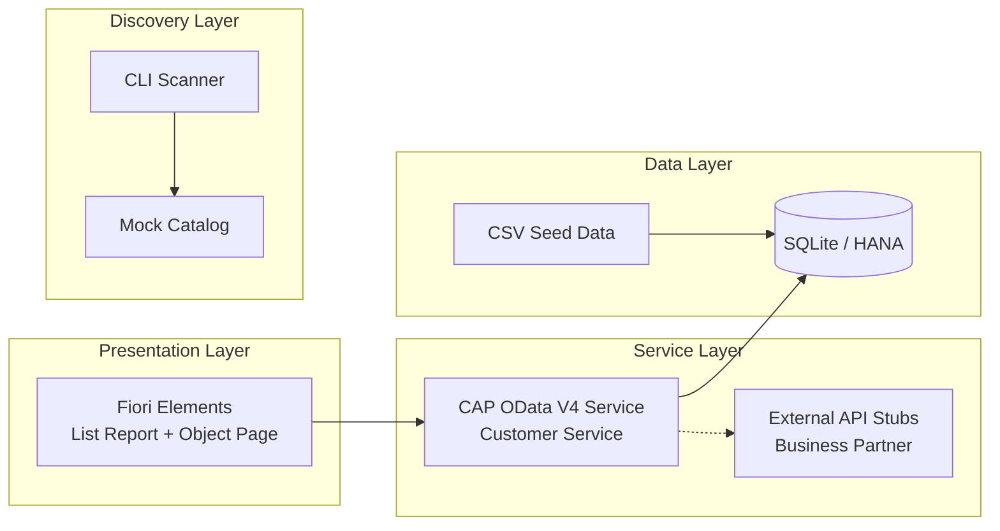
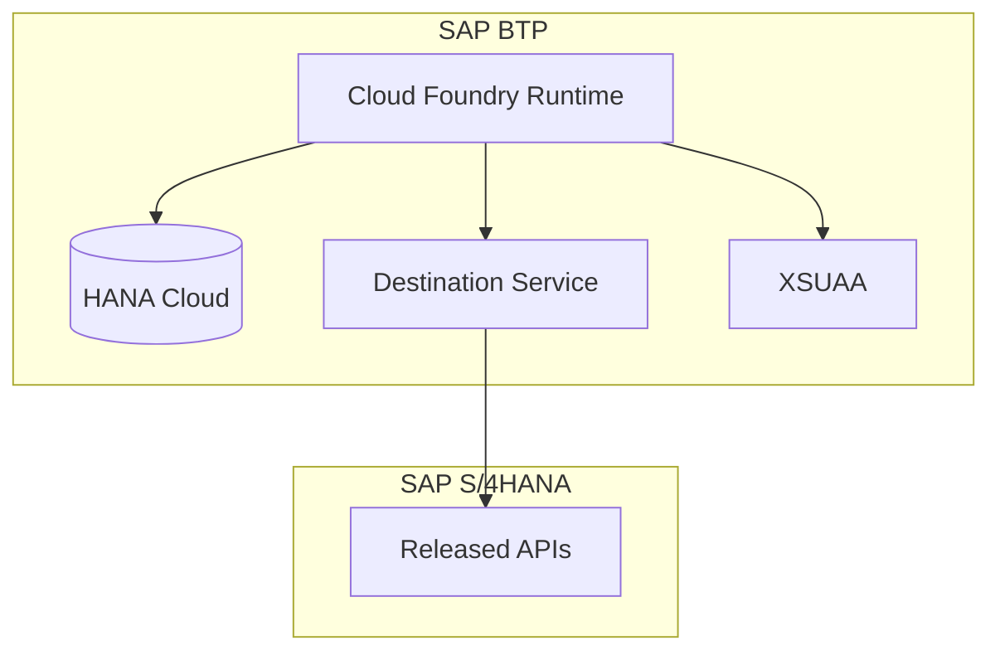

# Architecture Overview

## System Architecture

SAP Connect follows a layered architecture aligned with SAP's recommended development model:

## Component Details

### CAP Backend (`srv/`)

The backend uses SAP Cloud Application Programming Model (CAP) with Node.js:

- **OData V4 service** with automatic CRUD operations
- **Draft support** for Customers entity (edit sessions)
- **Custom handlers** for business logic (project stats, BP lookup)
- **External service stubs** showing how to integrate with SAP APIs

### Fiori Elements Frontend (`app/`)

The frontend uses SAP Fiori Elements, which generates UI from metadata:

- **List Report** - filterable table of customers
- **Object Page** - customer details with projects sub-table
- **Annotations-driven** - UI defined in CDS, not code

### API Discovery (`discovery/`)

A standalone CLI module for scanning SAP systems:

- **Scanner** - connects to SAP system metadata endpoints
- **Report** - formats results for terminal or markdown
- **Mock Catalog** - demo data for offline use

### Client Configuration (`clients/`)

Template-based client management:

- **Environment files** - per-client SAP connection details
- **No code changes** - swap clients by changing config only
- **System type support** - Public Cloud, Private Cloud, BTP-only

## Data Flow

1. **User** opens Fiori Elements app in browser
2. **UI5** sends OData requests to CAP service
3. **CAP** handles requests, queries SQLite database
4. **CAP** can optionally call external SAP APIs (mocked in dev)
5. **Response** flows back through OData to UI

## Deployment Architecture (Future)

For production deployment:
- SQLite is replaced by **SAP HANA Cloud**
- Mock APIs are replaced by **BTP Destinations** pointing to real SAP systems
- Authentication is handled by **XSUAA** (SAP Authorization & Trust Management)
