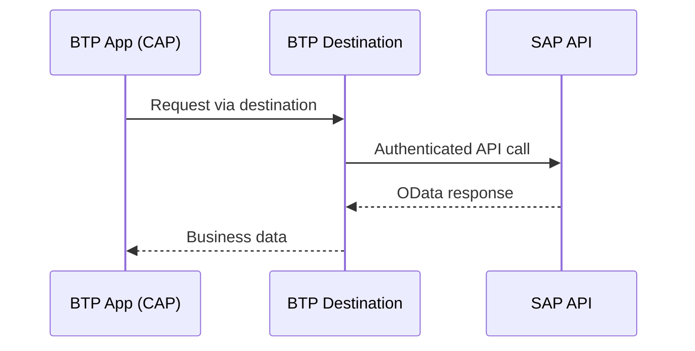
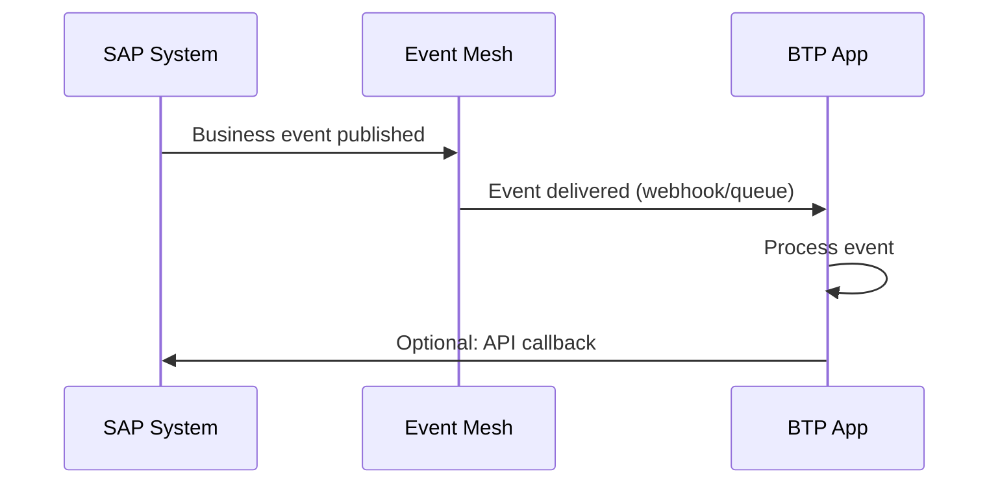

# Integration Patterns

## Overview

SAP provides three main integration patterns for external development. This guide covers when and how to use each.

## Pattern 1: API-Based Integration

Direct API calls to SAP systems via released OData/REST services.



**When to use:**
- CRUD operations on business objects
- Reading master data (Business Partners, Products)
- Creating transactional data (Sales Orders, Purchase Orders)

**Example in this toolkit:**
```javascript
// srv/customer-service.js
const bp = await cds.connect.to('API_BUSINESS_PARTNER');
const result = await bp.run(
  SELECT.from('A_BusinessPartner').where({ BusinessPartner: sapId })
);
```

**Key files:**
- `srv/external/API_BUSINESS_PARTNER.cds` - API definition
- `srv/customer-service.js` - API consumption
- `package.json` - Destination configuration

## Pattern 2: Event-Driven Integration

React to business events from SAP in real-time via Event Mesh.



**When to use:**
- Real-time reactions to business changes
- Loose coupling between systems
- Replacing polling-based integrations

**Common events:**
| Event | Topic |
|-------|-------|
| BP Created | `sap/s4/beh/businesspartner/v1/BusinessPartner/Created/v1` |
| BP Changed | `sap/s4/beh/businesspartner/v1/BusinessPartner/Changed/v1` |
| SO Created | `sap/s4/beh/salesorder/v1/SalesOrder/Created/v1` |
| PO Created | `sap/s4/beh/purchaseorder/v1/PurchaseOrder/Created/v1` |

## Pattern 3: Key User Extensibility

Extend SAP objects without code using built-in tools.

**Capabilities:**
- **Custom Fields** - Add fields to standard business objects
- **Custom Logic** - Add validation/determination via BAdIs
- **Custom CDS Views** - Create reporting views on released objects
- **Custom Business Objects** - Simple CRUD objects in SAP

**When to use:**
- Simple field additions to existing objects
- Basic business rules that belong in SAP
- Reporting views that need SAP-side data

**Limitations:**
- No complex logic (use BTP for that)
- Limited to released objects and extension points
- Changes are tenant-specific

## Choosing the Right Pattern

| Requirement | Pattern | Reason |
|-------------|---------|--------|
| Read/write SAP data from external app | API | Direct, synchronous access |
| React to SAP changes in real-time | Events | Loose coupling, no polling |
| Add a field to Sales Order | Key User | Simple, no deployment needed |
| Complex business process orchestration | API + Events | Combine for full workflow |
| Custom UI on SAP data | API + Fiori | BTP app with SAP data source |
| Reporting across systems | API | Aggregate data externally |

## Combining Patterns

Most real projects combine multiple patterns:

```
1. Key User adds custom field to Business Partner
2. Event fires when BP is changed
3. BTP app receives event, reads full BP via API
4. BTP app updates external CRM system
```

This toolkit demonstrates Pattern 1 (API) with the foundation for Pattern 2 (Events) via the discovery module.
